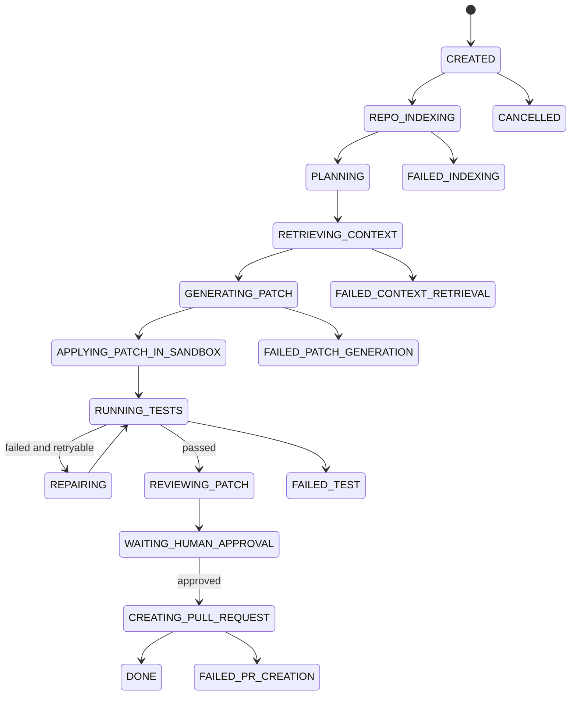

# Agent 工作流设计

## 1. Agent 编排目标

Agent 工作流负责把自然语言任务转成可审查、可测试、可创建 PR 的工程产物。MVP 使用 LangGraph 实现长任务状态机，Spring Boot 负责持久化任务状态和对外 API。

## 2. Agent 角色

| Agent | 职责 | 输入 | 输出 |
| --- | --- | --- | --- |
| PlannerAgent | 理解需求并拆解步骤 | 用户任务、项目摘要、约束 | 执行计划 |
| RepoAnalyzerAgent | 分析项目结构 | 文件树、AST 索引 | 项目结构摘要 |
| RetrieverAgent | 检索相关上下文 | 任务、计划、代码索引 | 相关文件、类、方法、chunk |
| CoderAgent | 生成代码修改 | 计划、上下文、约束 | unified diff |
| TestAgent | 执行编译和测试 | diff、仓库路径 | 测试结果 |
| RepairAgent | 根据失败日志修复 | 测试日志、原 diff | 新 diff |
| ReviewAgent | 审查风险 | diff、上下文 | 风险报告 |
| PRAgent | 生成 PR 信息 | 最终 diff、测试结果 | PR 标题、描述 |

## 3. 状态机



## 4. Graph 节点设计

| 节点 | 动作 | 主要工具 |
| --- | --- | --- |
| `load_task_context` | 加载任务、项目、仓库快照 | Backend API |
| `ensure_index` | 确保代码索引存在 | `list_project_files`, `get_class_structure` |
| `plan_task` | 生成计划 | LLM |
| `retrieve_context` | 检索代码 | `search_code`, `read_file` |
| `generate_patch` | 生成 unified diff | 当前为 Spring Coder recipe catalog：支持分页接口、User id 参数校验、User count API 和 User create API recipe；recipe 未命中时可进入可配置 Coder model client，`openai-compatible` 模式会调用 Chat Completions 兼容接口并把 raw response 交给统一 parser；若模型未启用或未返回 patch，则进入 `SAFE_PLANNING_FALLBACK`，生成 retrieval-grounded Coder plan diff，包含候选文件、符号、行号、建议编辑顺序和验证门槛 |
| `validate_patch_safety` | 预检 unified diff 安全边界 | 拒绝路径穿越、绝对路径、Windows/反斜杠路径、`.git`/secret 目录和二进制 patch |
| `apply_patch` | 在 Docker 沙箱工作区应用 diff | `git apply` |
| `run_tests` | 在 Docker 沙箱执行 Maven 测试并写入 `test_run` | `mvn -q test` |
| `repair_patch` | 根据日志修复 | 当前支持 Maven 测试依赖缺失时补充 `spring-boot-starter-test`，以及常见 Java 标准库缺 import 导致的 `cannot find symbol` 编译失败；后续增强为 LLM + `read_file` |
| `review_patch` | 风险审查 | 当前为规则化 diff/test 审查；后续增强为 LLM + `get_git_diff` |
| `wait_approval` | 暂停等待人工审批 | Backend API |
| `create_pr` | 创建 PR | `create_branch`, `commit_changes`, `create_pull_request` |

Python Agent Worker 当前提供最小服务契约：`GET /health` 返回 worker 健康状态，`POST /runs/{runId}/start` 接收 run 启动请求并返回 MVP graph node 清单。`./scripts/agent-worker-smoke.sh` 会启动或复用 worker，验证该契约并把证据写入 `output/agent-worker-smoke/last-run.json`。Spring Boot 后端已提供可配置的 Worker 启动桥：设置 `REPOPILOT_AGENT_WORKER_ENABLED=true` 后，后台执行会先调用 Worker start API，并记录 `agent_worker_start` step；Worker 调用失败只会写入失败 step，当前主执行链路仍由 Spring Boot 后台 executor 兜底。后续再把节点执行逐步迁移到 LangGraph worker，并通过 Backend API 回写 step、tool call、model call 和 task 状态。

## 5. AgentRunState

```json
{
  "taskId": 1,
  "projectId": 1,
  "runId": 1,
  "repoPath": "/workspace/repos/1",
  "baseBranch": "main",
  "targetBranch": "repopilot/task-1",
  "taskType": "FEATURE",
  "userRequest": "给 User 模块新增分页查询接口",
  "projectSummary": "...",
  "plan": [],
  "retrievedContext": [],
  "diff": "",
  "testResult": null,
  "repairAttempts": 0,
  "reviewReport": null,
  "approvalStatus": "PENDING"
}
```

## 6. 计划输出格式

PlannerAgent 输出必须是结构化 JSON：

```json
{
  "summary": "新增 User 分页查询接口",
  "steps": [
    {
      "order": 1,
      "title": "定位 User Controller 和 Service",
      "reason": "需要保持现有接口风格一致",
      "expectedFiles": ["UserController.java", "UserService.java"]
    }
  ],
  "risks": ["可能需要新增分页 DTO"],
  "testStrategy": "运行 mvn test，并补充 Controller 单元测试"
}
```

## 6.1 Coder 输出契约

LLM CoderAgent 的 raw response 必须满足以下契约，才能进入 `patch_record`、`validate_patch_safety` 和沙箱执行：

- 只输出 raw unified diff，且第一行必须是 `diff --git ...`；或只输出一个 ```diff 代码块。
- 不允许在 diff 前后附加解释性 prose。
- 不允许输出多个 diff 代码块。
- 解析后持久化为 `generationMode=LLM_CODER_DRAFT`。
- 解析后的 diff 仍必须通过 `validate_patch_safety`，再进入 Docker `git apply`。

## 6.2 Coder 模型客户端模式

`repopilot.coder.mode` 控制 recipe 未命中后的 Coder 模型入口：

| 模式 | 行为 |
| --- | --- |
| `disabled` | 默认模式，不调用模型，直接进入 `SAFE_PLANNING_FALLBACK` |
| `fixture` | 使用 `repopilot.coder.fixture-response` 作为 raw Coder response，走 `CoderPatchOutputParser` 并生成 `LLM_CODER_DRAFT` |
| `openai` / `openai-compatible` | 调用 `${repopilot.coder.api-base-url}/chat/completions`，使用 `repopilot.coder.api-key`、`repopilot.coder.model`、检索上下文和严格 diff-only prompt 生成 raw Coder response，再统一进入 `CoderPatchOutputParser` |

所有真实模型输出都必须复用同一个 `CoderModelClient` 接口，输出 raw response 后统一进入 parser、安全预检、沙箱测试和 review。未配置 key 或 model 时，`openai-compatible` 模式会在 patch 生成阶段返回配置错误，不会绕过安全链路。成功生成的 patch 会记录 `generationProvider` 和 `generationModel`，并同步进入 `generate_patch` 的 step output、运行报告和 model call 审计，方便区分本地 recipe、fixture 和真实 OpenAI-compatible Coder。

`openai-compatible` 模式已用本地 Chat Completions HTTP stub 做生产状态机级验证：Agent 会真实发送 Authorization header、模型名、diff-only system/developer prompt 和检索上下文，收到 raw diff 后继续进入同一 parser、安全预检、Docker 沙箱测试、ReviewAgent 和人工审批暂停点。真实 token 环境只需替换 API base URL、key 和 model，不改变后续安全链路。

真实 token 演示前可运行 `./scripts/real-token-demo-check.sh` 做只读体检；默认模式会提示 `REPOPILOT_CODER_MODE=openai-compatible`、`REPOPILOT_CODER_API_KEY`/`OPENAI_API_KEY` 和 `REPOPILOT_CODER_MODEL` 是否到位但不失败，`--strict` 模式会在真实 Coder 缺项时返回非 0。脚本只展示密钥是否配置，不打印模型 key 或 Authorization header。

真实模型 API 级端到端演示可运行 `./scripts/real-coder-demo.sh`。该脚本在真实 Coder 配置 ready 时创建临时用户和本地 demo 项目，发起一个不会命中 recipe catalog 的最小任务，要求模型只新增 `.repopilot/real-coder-demo-note.md`，然后验证 `LLM_CODER_DRAFT`、`OPENAI_COMPATIBLE`、`generate_patch` model call、diff 安全预检、Docker 沙箱 `mvn -q test` 和 `WAITING_HUMAN_APPROVAL` 暂停点。脚本会清理临时业务数据，并只输出脱敏证据。

`GET /api/settings/coder` 提供当前 Coder 模型入口的只读脱敏状态，前端可展示 mode、provider、model、API base URL、key 是否配置、fixture 是否配置、缺失项和支持模式，但不返回 API key、fixture response、organization 或 project 原文。

## 7. 检索输出格式

RetrieverAgent 输出：

```json
{
  "files": [
    {
      "path": "src/main/java/.../UserController.java",
      "reason": "包含 User 相关 API",
      "symbols": ["UserController#listUsers"]
    }
  ],
  "chunks": [
    {
      "chunkId": 101,
      "path": "src/main/java/.../UserService.java",
      "score": 0.82,
      "summary": "User 查询业务逻辑"
    }
  ]
}
```

## 8. 重试策略

| 阶段 | MVP 重试 | 说明 |
| --- | --- | --- |
| 仓库 clone | 1 次 | 网络或权限失败直接展示原因 |
| 索引 | 1 次 | 解析失败记录文件路径 |
| 检索 | 0 次 | 返回空上下文时进入失败状态 |
| diff 生成 | 1 次 | diff 格式不合法或安全预检失败时重新生成 |
| 测试修复 | 2 次 | RepairAgent 最多尝试 2 次；当前已支持缺失 `spring-boot-starter-test` 和常见 Java 标准库 import 的确定性修复 |
| PR 创建 | 1 次 | GitHub API 失败保留分支和错误 |

## 9. Human-in-the-loop

`WAITING_HUMAN_APPROVAL` 是持久化暂停点。Agent 不应绕过审批继续创建 PR。

审批动作：

- `APPROVE`：允许创建 PR。
- `REJECT`：结束当前 patch，任务进入拒绝状态或允许重新生成。
- `REGENERATE`：基于用户反馈重新进入 `GENERATING_PATCH`。

## 10. 项目写入互斥

MVP 使用项目级写入槽保护本地工作区：启动 run、重新生成 patch、审批通过进入 PR 阶段，以及实际准备 PR 前，后端会锁定对应 `project` 行并检查同项目是否存在其他写入型任务。写入型状态包括 `REPO_INDEXING`、`PLANNING`、`RETRIEVING_CONTEXT`、`GENERATING_PATCH`、`APPLYING_PATCH_IN_SANDBOX`、`RUNNING_TESTS`、`REPAIRING`、`REVIEWING_PATCH` 和 `CREATING_PULL_REQUEST`。

如果写入槽被其他任务占用，当前操作返回 `409 PROJECT_WRITE_TASK_RUNNING`。当前任务自身不计入冲突，因此从审批到 PR 准备的连续推进仍然可执行。

## 11. 事件流

`POST /api/agent/tasks/{id}/run` 只负责创建 run 并提交后台执行。后续节点在后台 executor 中按状态机推进；前端任务详情页通过带 `Authorization` header 的 `fetch` 订阅 `/stream`，收到事件后安静刷新任务详情、步骤、patch、测试和审计面板，并保留任务详情/步骤接口轮询作为断线兜底。`/stream` 会先发送 task/run/step 快照，并在后台执行期间持续推送 `TASK_UPDATED`、`STEP_RECORDED` 和 `STREAM_COMPLETE`。

取消任务会把 task 与当前 run 标为 `CANCELLED`。后台执行不会强杀已经进入的外部命令，但会在命令前后和每个状态转换点检查最新 task 状态，一旦发现取消就停止后续节点，避免继续生成审批态结果。

每个节点开始和结束时产生事件：

```json
{
  "taskId": 1,
  "runId": 1,
  "eventType": "STEP_FINISHED",
  "stepName": "run_tests",
  "status": "SUCCESS",
  "message": "mvn test passed",
  "createdAt": "2026-07-08T21:00:00+08:00"
}
```

## 12. Step Evidence View

任务详情页除了展示完整 step timeline、model call audit 和 tool call audit，还会把稳定的 `agent_step.input_json` / `output_json` 字段解析成 Agent evidence 面板：

- `plan_task` 展示 planner 摘要、计划步骤和检索 query。
- `retrieve_context` 展示命中代码 chunk 数、query 命中数和关键文件/符号/行号。
- `generate_patch` 展示 patch id、状态、分支、摘要、`generationMode`、`generationProvider` 和 `generationModel`。
- `validate_patch_safety` 展示 diff 安全门是否通过。
- `run_tests` 展示沙箱命令、退出码、耗时和日志摘要。
- `review_patch` 展示风险等级、审查摘要和 findings。
- `waiting_human_approval` 展示人工审批暂停点和关联 patch。

该视图不替代原始审计 JSON；它用于演示和快速排查，让用户能直接看到每个 Agent 阶段“依据什么继续推进”。

`GET /api/agent/tasks/{id}/run-report` 会在后端读取当前 run 的同一批 step JSON，生成结构化 sections 和 Markdown 报告。前端在 Agent evidence 面板中提供当前报告复制、下载和保存快照操作，用于把本次 run 的计划、检索、patch、安全预检、测试、审查和审批 checkpoint 作为可分享审计产物导出。保存后的 `agent_run_report_snapshot` 是不可变 Markdown 留档，后续 Regenerate 或重新运行任务替换 current run 后，历史快照仍可复制或下载。
