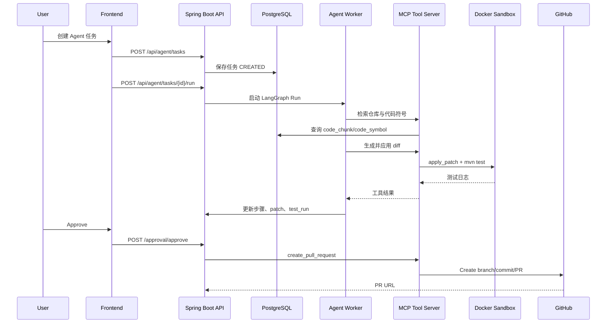

# 总体技术架构

## 1. 架构目标

RepoPilot 的架构必须同时满足三个目标：

1. 后端平台能力完整：鉴权、项目管理、任务状态、审批、日志、数据库、异步执行。
2. Agent 编排清晰：计划、检索、生成、测试、修复、审查、PR 创建分阶段执行。
3. 工程风险可控：代码执行隔离，diff 可审查，所有工具调用可追踪。

## 2. MVP 技术路线

```text
Web Frontend
  -> Spring Boot Backend
      -> PostgreSQL + pgvector
      -> Redis
      -> Python LangGraph Agent Worker
      -> Spring AI MCP Tool Server
          -> Git CLI
          -> JavaParser
          -> Maven
          -> Docker Sandbox
          -> GitHub REST API
```

## 3. 服务边界

| 服务 | 技术 | 职责 |
| --- | --- | --- |
| Web 前端 | React 或 Vue 3 | 项目管理、任务创建、日志流、diff 预览、审批 |
| Backend API | Spring Boot 3 | 鉴权、项目、任务、审批、PR、日志、配置 |
| Agent Worker | Python + LangGraph | 多 Agent 状态机、模型调用、计划执行、失败修复 |
| MCP Tool Server | Spring Boot + Spring AI MCP | 暴露文件、AST、检索、Git、Maven、Docker、GitHub 工具 |
| PostgreSQL | PostgreSQL + pgvector | 业务数据、代码索引、向量数据、日志数据 |
| Redis | Redis | 任务锁、短期状态、异步队列、SSE 事件缓存 |
| Docker Sandbox | Docker | 隔离执行补丁应用、编译、测试 |

## 4. 核心请求链路



## 5. 数据流

| 数据 | 产生方 | 存储位置 | 消费方 |
| --- | --- | --- | --- |
| 用户与项目信息 | Backend API | PostgreSQL | 前端、Agent Worker |
| 仓库快照 | Repository 模块 | PostgreSQL | Indexer、Agent |
| Java 符号 | Indexer 模块 | PostgreSQL | RetrieverAgent、项目详情页 |
| 代码 chunk | Indexer 模块 | PostgreSQL + pgvector | RetrieverAgent |
| Agent 步骤 | Agent Worker | PostgreSQL | 前端日志页 |
| 工具调用日志 | MCP Tool Server | PostgreSQL | 审计页、失败排查 |
| diff | CoderAgent/MCP | PostgreSQL | diff 预览、审批、PR |
| 测试日志 | Docker Sandbox | PostgreSQL 或对象存储 | 测试日志页、RepairAgent |

## 6. 部署视图

MVP 使用 Docker Compose 管理依赖：

```text
docker-compose
├── backend-api
├── agent-worker
├── mcp-tool-server
├── postgres
├── redis
└── sandbox-runner 或宿主 Docker socket 受控访问
```

## 7. 安全边界

- Backend API 是外部入口，所有用户请求先经过鉴权。
- Agent Worker 不直接访问用户密钥，只通过 Backend 获取授权后的任务上下文。
- MCP Tool Server 对工具参数做白名单校验，禁止访问仓库工作区外文件。
- Docker Sandbox 使用临时容器和临时工作目录，任务结束后清理。
- 创建 PR 前必须检查 patch 状态为 `APPROVED`。

## 8. 关键架构决策

| 编号 | 决策 | 理由 |
| --- | --- | --- |
| ADR-001 | MVP 采用 Java 平台 + Python Worker | 兼顾 Java 后端展示和成熟 Agent 编排 |
| ADR-002 | 使用 pgvector | 减少部署复杂度，满足中小型代码库检索 |
| ADR-003 | diff 优先于直接改文件 | 便于审查、回滚和 PR 自动化 |
| ADR-004 | 测试必须在沙箱执行 | 避免不可信代码污染宿主环境 |
| ADR-005 | Agent 步骤持久化 | 支持长任务恢复、日志追踪和面试展示 |

